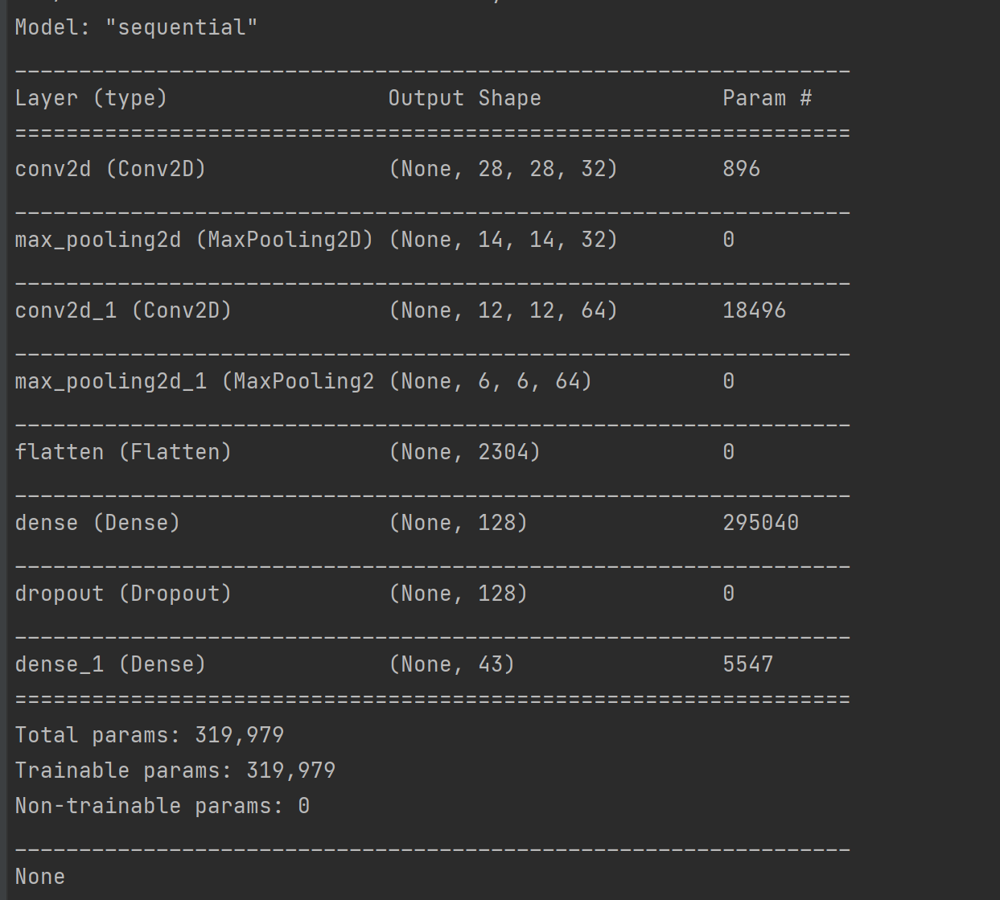

## Table of contents
* [Background](#background)
* [Model](#model)
* [Results and Discussion](#results)
* [Conclusion](#conclusion)

<h1 align=center>Classification of German Traffic Signs</h1>

## Background

As research continues in the development of self-driving cars, one of the key challenges is computer vision, allowing these cars to develop an understanding of their environment from digital images. In particular, this involves the ability to recognize and distinguish road signs – stop signs, speed limit signs, yield signs, and more.

In this project, you’ll use TensorFlow to build a neural network to classify road signs based on an image of those signs. To do so, you’ll need a labeled dataset: a collection of images that have already been categorized by the road sign represented in them.

Several such data sets exist, but for this project, we’ll use the German Traffic Sign Recognition Benchmark (GTSRB) dataset, which contains thousands of images of 43 different kinds of road signs.

## Model

Build a Convolution Neural Networt to train and classify the road signs provided by the GTSRB dataset.

### Model 1

<h5 align=center>Fig 1.1 - Model 1</h5>

The model consists of a convolution layer of 32 - 3x3 filters utilizing ReLu activation, followed by a MaxPooling layer of 2x2, followed by a fully connected dense layer with 128 nodes utilizing ReLu activation and final output layer with 43 nodes utilizing softmax activation, to classify the output into the 43 different kinds of road signs.

`   
    
    tf.keras.models.Sequential([
            tf.keras.layers.Conv2D(
            32, (3, 3), activation='relu', input_shape=(IMG_WIDTH, IMG_HEIGHT, 3)),
            tf.keras.layers.MaxPooling2D(pool_size=(2, 2)),
            tf.keras.layers.Flatten(),
            tf.keras.layers.Dense(128, activation="relu"),
            tf.keras.layers.Dropout(0.50),
            tf.keras.layers.Dense(NUM_CATEGORIES, activation="softmax")
        ])
        
  `
  
The model resulted with an accuracy rate of 96.96.

<h5 align=center>Fig 1.2 - Model 1: Training Results</h5>

<h5 align=center>Fig 1.3 - Model 1: Model Summary</h5>

### Model 2

<h5 align=center>Fig 2.1 - Model 2</h5>

Model 1 provided an accuracy of 96.96, decided to modify the convolution layer.

The model consists of a convolution layer of 64 - 3x3 filters utilizing ReLu activation, followed by a MaxPooling layer of 2x2, followed by a fully connected dense layer with 128 nodes utilizing ReLu activation and final output layer with 43 nodes utilizing softmax activation, to classify the output into the 43 different kinds of road signs.

The model resulted with an accuracy rate of 97.57.

`   
    
    tf.keras.models.Sequential([
            tf.keras.layers.Conv2D(
            64, (3, 3), activation='relu', input_shape=(IMG_WIDTH, IMG_HEIGHT, 3)),
            tf.keras.layers.MaxPooling2D(pool_size=(2, 2)),
            tf.keras.layers.Flatten(),
            tf.keras.layers.Dense(128, activation="relu"),
            tf.keras.layers.Dropout(0.50),
            tf.keras.layers.Dense(NUM_CATEGORIES, activation="softmax")
        ])
        
  `

<h5 align=center>Fig 2.2 - Model 2: Training Results</h5>

<h5 align=center>Fig 2.3 - Model 2: Model Summary</h5>

### Model 3

<h5 align=center>Fig 3.1 - Model 3</h5>

The previous two models produced an accuracy rate of less than 98%. Modified the network to see if I can improve the accuracy rate.

The model consists of a convolution layer of 32 - 3x3 filters utilizing ReLu activation, followed by another convolution layer of 64 - 3x3 filter utilizing ReLu activation, followed by a MaxPooling layer of 2x2, followed by a fully connected dense layer with 128 nodes utilizing ReLu activation and final output layer with 43 nodes utilizing softmax activation, to classify the output into the 43 different kinds of road signs.

The model resulted with an accuracy rate of 99.11.

`   
    
    tf.keras.models.Sequential([
            tf.keras.layers.Conv2D(
            32, (3, 3), activation='relu', input_shape=(IMG_WIDTH, IMG_HEIGHT, 3)),
            tf.keras.layers.Conv2D(
            64, (3, 3), activation='relu', input_shape=(IMG_WIDTH, IMG_HEIGHT, 3)),
            tf.keras.layers.MaxPooling2D(pool_size=(2, 2)),
            tf.keras.layers.Flatten(),
            tf.keras.layers.Dense(128, activation="relu"),
            tf.keras.layers.Dropout(0.50),
            tf.keras.layers.Dense(NUM_CATEGORIES, activation="softmax")
        ])
        
  `

<h5 align=center>Fig 3.2 - Model 3: Training Results</h5>

<h5 align=center>Fig 3.3 - Model 3: Model Summary</h5>

### Model 4

<h5 align=center>Fig 4.1 - Model 4</h5>

The last model produced an accuracy rate of less than 99%. Modified the network to see if I can improve the accuracy rate with lesser parameters.

The model consists of a convolution layer of 32 - 3x3 filters utilizing ReLu activation, followed by a MaxPooling layer of 2x2, followed by another convolution layer of 64 - 3x3 filter utilizing ReLu activation, followed by a MaxPooling layer of 2x2, followed by a fully connected dense layer with 128 nodes utilizing ReLu activation and final output layer with 43 nodes utilizing softmax activation, to classify the output into the 43 different kinds of road signs.

The model resulted with an accuracy rate of 98.60.

`   
    
    tf.keras.models.Sequential([
            tf.keras.layers.Conv2D(
            32, (3, 3), activation='relu', input_shape=(IMG_WIDTH, IMG_HEIGHT, 3)),
            tf.keras.layers.MaxPooling2D(pool_size=(2, 2)),
            tf.keras.layers.Conv2D(
            64, (3, 3), activation='relu', input_shape=(IMG_WIDTH, IMG_HEIGHT, 3)),
            tf.keras.layers.MaxPooling2D(pool_size=(2, 2)),
            tf.keras.layers.Flatten(),
            tf.keras.layers.Dense(128, activation="relu"),
            tf.keras.layers.Dropout(0.50),
            tf.keras.layers.Dense(NUM_CATEGORIES, activation="softmax")
        ])
        
  `

<h5 align=center>Fig 4.2 - Model 4: Training Results</h5>

<h5 align=center>Fig 4.3 - Model 4: Model Summary</h5>

### Model 5

<h5 align=center>Fig 5.1 - Model 5</h5>

Modified the network to see if I can improve the accuracy rate with lesser parameters by introducing another fuly connected dense layer.

The model consists of a convolution layer of 32 - 3x3 filters utilizing ReLu activation, followed by a MaxPooling layer of 2x2, followed by another convolution layer of 64 - 3x3 filter utilizing ReLu activation, followed by a MaxPooling layer of 2x2, followed by a fully connected dense layer with 128 nodes utilizing ReLu activation, followed by a fully connected dense layer with 128 nodes utilizing ReLu activation  and final output layer with 43 nodes utilizing softmax activation, to classify the output into the 43 different kinds of road signs.

The model resulted with an accuracy rate of 98.32.

`   
    
    tf.keras.models.Sequential([
            tf.keras.layers.Conv2D(
            32, (3, 3), activation='relu', input_shape=(IMG_WIDTH, IMG_HEIGHT, 3)),
            tf.keras.layers.MaxPooling2D(pool_size=(2, 2)),
            tf.keras.layers.Conv2D(
            64, (3, 3), activation='relu', input_shape=(IMG_WIDTH, IMG_HEIGHT, 3)),
            tf.keras.layers.MaxPooling2D(pool_size=(2, 2)),
            tf.keras.layers.Flatten(),
            tf.keras.layers.Dense(128, activation="relu"),
            tf.keras.layers.Dense(128, activation="relu"),
            tf.keras.layers.Dropout(0.50),
            tf.keras.layers.Dense(NUM_CATEGORIES, activation="softmax")
        ])
        
  `

<h5 align=center>Fig 5.2 - Model 5: Training Results</h5>

<h5 align=center>Fig 5.3 - Model 5: Model Summary</h5>

Repeated the above 5 models with the convolution layer using a 5x5 filter.  The best result was model three with an accuracy rate of 99.30

### Model 6

<h5 align=center>Fig 6.1 - Model 6</h5>

<h5 align=center>Fig 6.2 - Model 6: Training Results</h5>

<h5 align=center>Fig 6.3 - Model 6: Model Summary</h5>

### Model 7

<h5 align=center>Fig 7.1 - Model 7</h5>

<h5 align=center>Fig 7.2 - Model 7: Training Results</h5>

<h5 align=center>Fig 7.3 - Model 7: Model Summary</h5>

### Model 8

]
<h5 align=center>Fig 8.1 - Model 8</h5>

<h5 align=center>Fig 8.2 - Model 8: Training Results</h5>

<h5 align=center>Fig 8.3 - Model 8: Model Summary</h5>

### Model 9

]
<h5 align=center>Fig 9.1 - Model 9</h5>

<h5 align=center>Fig 9.2 - Model 9: Training Results</h5>

<h5 align=center>Fig 9.3 - Model 9: Model Summary</h5>

### Model 10

]
<h5 align=center>Fig 10.1 - Model 10</h5>

<h5 align=center>Fig 10.2 - Model 10: Training Results</h5>

<h5 align=center>Fig 10.3 - Model 10: Model Summary</h5>

## Results and Discussions

The below table summarize the results of experimenting with various combinations in the convolution neural network.

| Model | Accuracy | Parameters
| ----------- | ----------- |
| Model 1 | 0.9696 |809,487
| Model 2 | 0.9757 |1,613,099
| Model 3 | 0.9911 |1,409,515
| Model 4 | 0.9860 |319,979
| Model 5 | 0.9832 |336,491
| Model 6 | 0.9746 |700,331
| Model 7 | 0.9778 |1,394,987
| **Model 8** | **0.9930** |**1,050,603**
| Model 9 | 0.9872 |190,443
| Model 10 | 0.9815 |206,955

I got better results using a 5x5 filter in the convolution layer, keeping all other hyper-parameters constant.

## Conclusion

Need to do more experimentation with other combination of pooling layers, other hyper-parameters such as learning rates, optimizers, losses, dropout rate, etc.  

