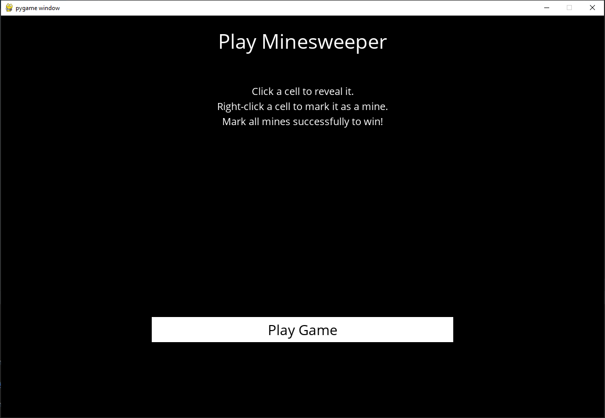
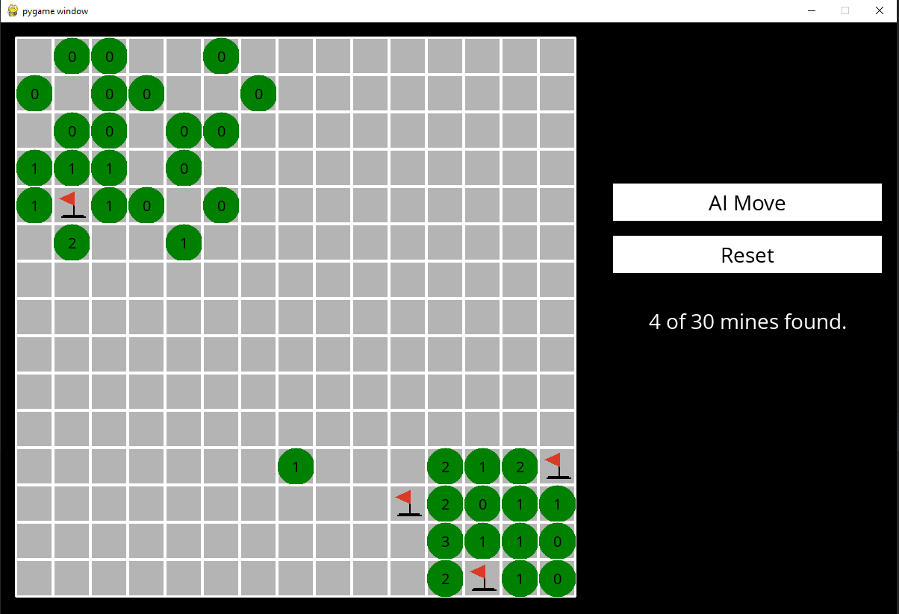

<h1 align=center>MINESWEEPER </h1>

### The game can be played by the individual or let the AI Bot play the game.

# What's in the Repo?

 - A fully playable Minesweeper environment that utilizes pygame.
 - A bot trained using knowlege engineering - exploring the concepts of knowledge base and inference alogorithms . 
 - minewseeper.py - logic to play minesweeper by an individual or the bot
 - runner.py - to the draw the minesweeper board
 
 # To Test
 
 run python runner.py
